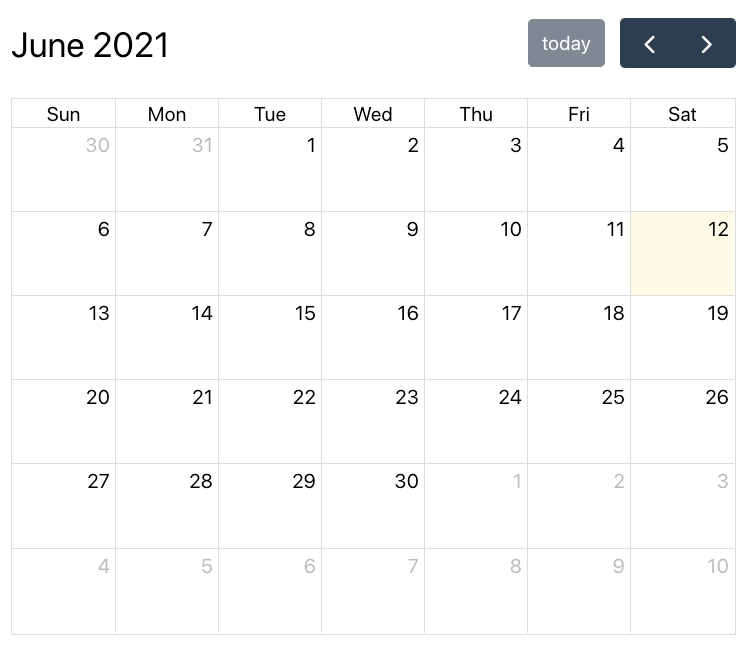
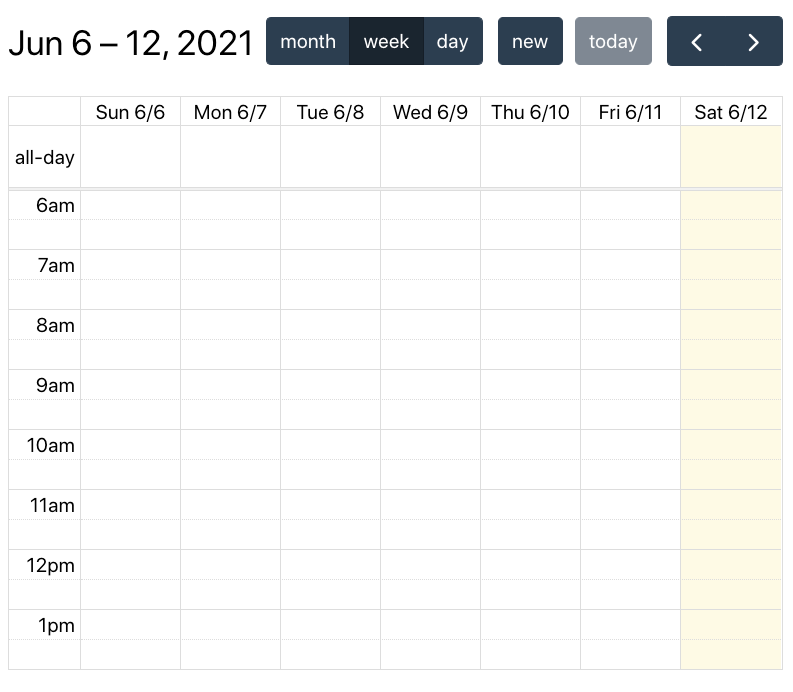
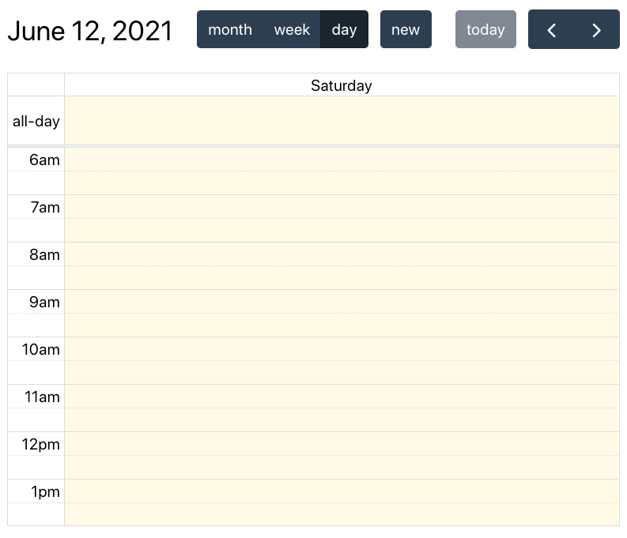
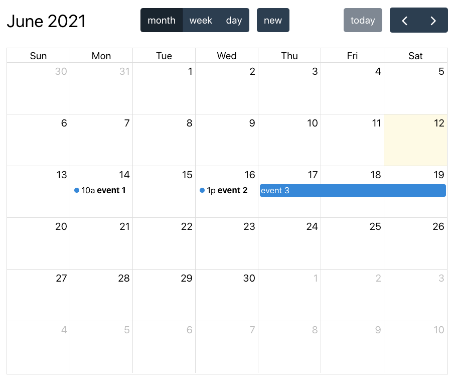

Учебный проект курса Kotlin Backend

TimeKeep - Календарь "напоминание"

##Описание проекта

Календарь содержит сущности "напоминание" (название, дата-время, описание, повторяемость и т.д.)

TimeKeep - это удобное приложение-календарь, предназначенное для управления временем и планирования повседневных 
задач и встреч. Приложение предоставляет возможность создания, отслеживания и управления напоминаниями, событиями и 
задачами, а также отправляет уведомления для помощи пользователям в своевременном выполнении дел и встреч. 
TimeKeep обеспечивает интуитивно понятный интерфейс, информативное отображение расписания и возможность настройки 
повторяемых событий, что делает его незаменимым инструментом для эффективного управления временем.

## Визуальная схема фронтенда (React)

## MVP (минимально жизнеспособный продукт) TimeKeep - Календарь "напоминание"

MVP (минимально жизнеспособный продукт)для календаря с сущностью "напоминание" должен включать в себя основные \
функциональные возможности, необходимые для выполнения базовых задач пользователей. \ 
Описание MVP для такого календаря может выглядеть следующим образом:

1. Создание напоминания: Пользователь может добавлять новые напоминания, \
   указывая их название, дату и время события, описание и опционально задавать повторяемость.

2. Просмотр и управление напоминаниями: Пользователь может просматривать список всех созданных напоминаний, \
   редактировать и удалять их по необходимости.

3. Уведомления: Система отправляет пользователю уведомления о предстоящих напоминаниях в удобное \ 
   для пользователя время.

4. Базовый интерфейс: Пользовательский интерфейс приложения должен предоставлять удобное и интуитивно понятное \
   взаимодействие с созданием и просмотром напоминаний.

MVP должен нацелен на обеспечение базовых функций календаря с напоминаниями, чтобы пользователи могли успешно \
использовать его для управления своими повседневными делами и встречами.

## Документация

1. Маркетинг
    1. [Заинтересанты](./docs/01-marketing/01-stakeholders.md)
    2. [Целевая аудитория](./docs/01-marketing/02-target-audience.md)
    3. [Конкурентный анализ](./docs/01-marketing/03-concurrency.md)
    4. [Анализ экономики](./docs/01-marketing/04-economy.md)
    5. [Пользовательские истории](./docs/01-marketing/05-user-stories.md)
2. DevOps
    1. [Схема инфраструктуры](./docs/02-devops/01-infrastruture.md)
    2. [Схема мониторинга](./docs/02-devops/02-monitoring.md)
3. Тесты
4. Архитектура
   1. [Схема архитектуры](./docs/04-architecture/01-arch.md)
   2. [Схема интеграции](./docs/04-architecture/02-integration.md)
   3. [Схема апи](./docs/04-architecture/03-api.md)