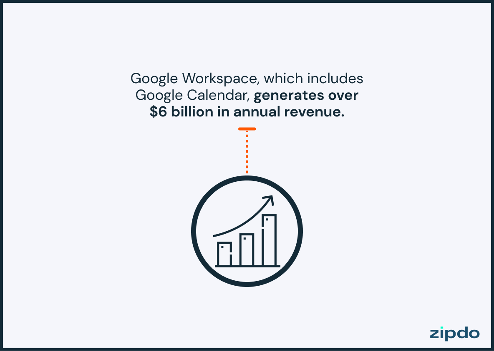
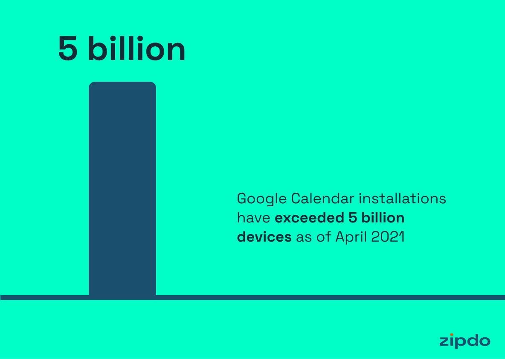

# Экономический анализ

За основу экономического анализа приложения Календарь можно взять данные о календаре Google, как об одном из лидеров \
рынка. 

В современном быстро меняющемся цифровом мире крайне важно сохранять организованность и эффективно \ 
управлять своим расписанием. Календарь Google, мощный и широко используемый инструмент, предлагает \
множество возможностей для управления временем, повышения производительности и, конечно же, \
планирования нашей личной и профессиональной жизни.

## Объем рынка

Обнародована последняя статистика Google Calendar \
По состоянию на 2021 год у Google Calendar более 500 миллионов пользователей из различных источников. \
В области статистики Google Calendar поразительное открытие подчеркивает растущую популярность платформы – \
с 2021 года ее сервисами воспользовались впечатляющие полмиллиарда пользователей из самых разных слоев общества. \
Это феноменальное число свидетельствует о замечательном глобальном охвате Google Calendar, возлагающем на него \
ответственность за оптимизацию управления временем и составления расписаний для своей разнообразной базы пользователей.\
Эта захватывающая статистика добавляет звездочку к выдающейся репутации приложения, еще раз демонстрируя \ 
его способность легко адаптироваться и удовлетворять различные потребности в управлении календарем в мире.

Более подробная информация:
[Ссылка](https://zipdo.co/statistics/google-calendar/)

Основные моменты: Наиболее важная статистика \
По состоянию на 2021 год у Google Calendar более 500 миллионов пользователей из различных источников. \
Ежедневно он обслуживает около 50 миллиардов событий, созданных пользователями. \
В ходе опроса 33% респондентов выбрали Google Calendar для использования в качестве рабочего календаря, \
что делает его вторым по популярности рабочим календарем.
Google Calendar - второе по популярности приложение для календаря, уступающее только приложению Apple Calendar. \
Google Calendar имеет рейтинг пользователей 4,4 из 5 звезд в Google Play Store после 3 миллионов отзывов \ 
по состоянию на октябрь 2021 года. \
Google Calendar занимает 4,2-е место из 5 в App Store по состоянию на октябрь 2021 года. \
Google Calendar занимает 9-е место по производительности в Google Play Store по состоянию на октябрь 2021 года. \
Google Calendar доступен на iOS, Android и веб-платформах. \
Интерфейс прикладного программирования Google Calendar (API) позволяет разработчикам создавать, запрашивать и \
изменять события календаря. \
По состоянию на апрель 2021 года Google Calendar был установлен более чем на 5 миллиардах устройств. \
Google Calendar является частью Google Workspace, у которой миллионы платящих клиентов по всему миру. \
Google Workspace, в состав которого входит Google Calendar, приносит годовой доход более 6 миллиардов долларов. \
Пользователи Google Calendar могут выбирать одну из пяти цветовых тем, которые помогают улучшить видимость и \
выделить события.\
Вы можете поделиться своим Google календарем одновременно с 75 людьми.\
В Google Calendar есть функция “Найти время”, которая сравнивает расписания, чтобы предложить лучшее время для встреч.\
Согласно опросу, Google Calendar является вторым по популярности инструментом планирования, используемым фрилансерами.\
Календарь Google может быть интегрирован с более чем 4000 приложениями через Zapier.\
Согласно данным Google Trends, количество запросов по запросу “Google Календарь” резко возросло в апреле и мае,\
что указывает на увеличение использования во время пандемии COVID-19.\
Google Calendar предлагает 32 типа готовых календарей, на которые можно подписаться, таких как праздники, \
спортивные мероприятия и фазы Луны.\
Согласно опросу, проведенному в 2019 году, 42% пользователей цифрового календаря в США использовали Google Calendar, \
по сравнению с 34% в 2012 году.\
Функция Google Calendar "Вне офиса" не только блокирует время в вашем календаре, но и автоматически отклоняет новые \
приглашения на этот период.\
Мобильное приложение Google Calendar было запущено для устройств iOS в 2015 году, через 10 лет после его веб-релиза.

